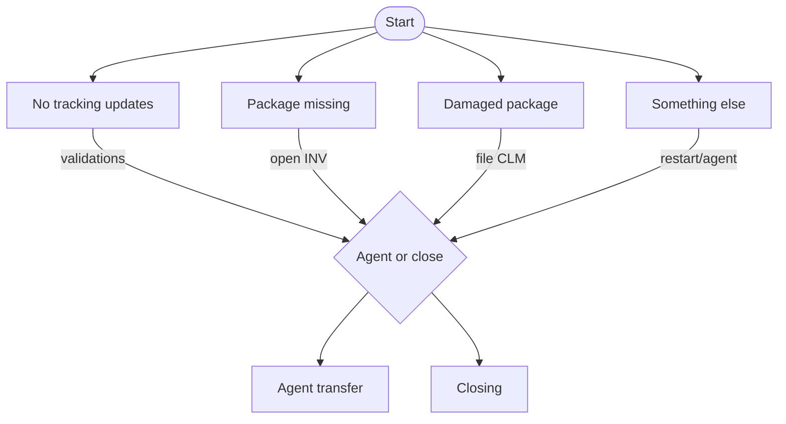
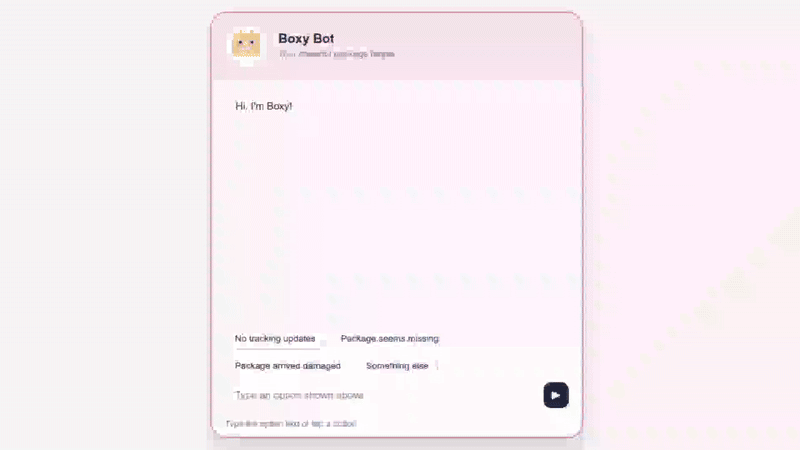
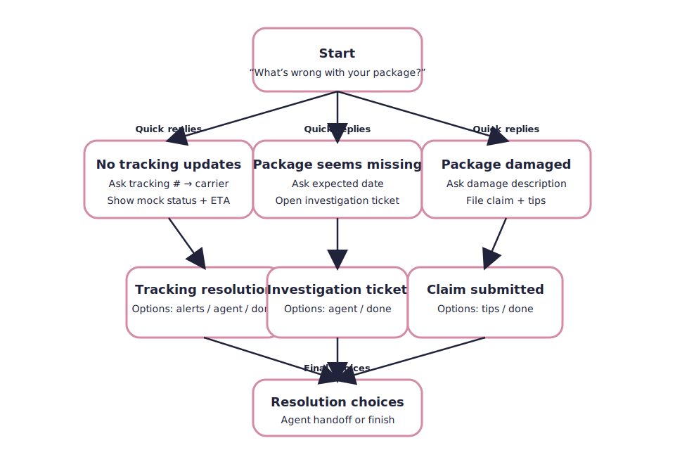
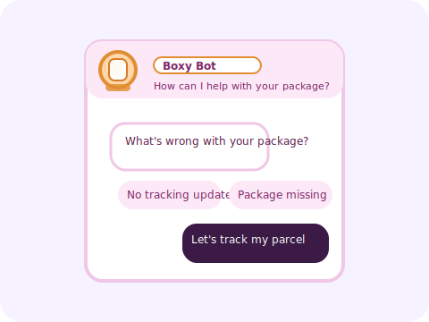

# Boxy — Lost Package Assistant

A simple chatbot prototype for the **eGain SWE Take‑Home Assignment** designed to help users recover lost packages.

---

## Setup / Installation

### For technical users

```bash
# clone the repo
git clone https://github.com/rmulcahy8/boxy-bot.git
cd boxy-bot

# run by opening index.html in a browser
# or serve locally:
python3 -m http.server 5500
```

Open `http://localhost:5500` in your browser.

### For non-technical users

1. Click the green **Code** button at the top of this repository.
2. Select **Download ZIP**.
3. Extract the ZIP file to a folder on your computer.
4. Open the extracted folder.
5. Double-click `index.html` to open it in your browser.

---

## Approach

* Scenario: **Helping a customer track a lost package**
* Conversation starts with four quick replies:

  * No tracking updates
  * Package seems missing
  * Package arrived damaged
  * Something else
* Each branch validates input, gives clear next steps, and routes to closure or agent handoff.
* Error handling included (tracking number, date, description length).
* Brief instructions are always displayed at the bottom of the chatbot window, guiding the user on what to do next.
* Users can either click one of the suggested quick reply buttons or type their answer directly.

---

## Conversation Flow

Conversation flowchart (see also `/assets/flowchart.svg`):



---

## Screenshots / Examples

GIF and SVG assets are in the `/assets/` folder:

```markdown



```

---

## Error Handling Examples

* **Tracking number too short/invalid:**

  * User: `123`
  * Bot: "Tracking numbers must be 8–22 characters. Please try again."

* **Future delivery date entered:**

  * User: `12/31/2099`
  * Bot: "That date is in the future. Please enter the actual expected delivery date."

---
