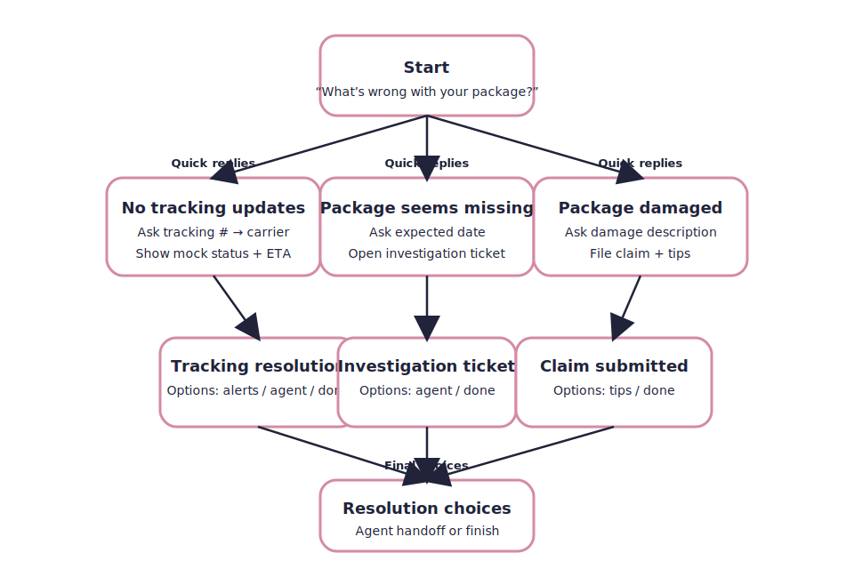

# Boxy Bot

Boxy Bot is a scripted package-tracking assistant designed for interview demos. The lightweight web widget mimics the experience of chatting with a shipping support bot without needing any backend services. It highlights state-machine driven conversations, quick replies, and guardrails for invalid data entry.

## Features

- **Guided decision tree:** Leads with “What’s wrong with your package?” and branches to three common issues.
- **State machine logic:** JavaScript orchestrates each step, manages context (tracking number, carrier, claims), and enforces validation rules.
- **Mock logistics data:** Generates believable last-scan summaries, estimated delivery dates, and ticket IDs.
- **Quick replies + targeted inputs:** Buttons drive most choices while text inputs capture tracking numbers, dates, or damage descriptions with inline hints.
- **Agent handoff fallback:** Off-topic questions reroute customers to continue troubleshooting or request a human.

## Getting started

1. Clone or download this repository.
2. Open `index.html` in any modern browser, or run a static file server and navigate to `http://localhost:PORT/index.html`.

No build step is required—the project is pure HTML, CSS, and vanilla JavaScript.

## Screenshots

## Conversation flowchart

## Future improvements

- Integrate real carrier APIs for live tracking data and proof-of-delivery events.
- Add semantic intent detection to understand freeform customer messages.
- Persist conversations with local storage or customer profiles.
- Support push/email alert preferences beyond the mock “set alerts” option.
- Expand the decision tree with multi-package handling and return workflows.

---

Built as a minimal, front-end only prototype for the “Boxy Bot” interview assignment.
